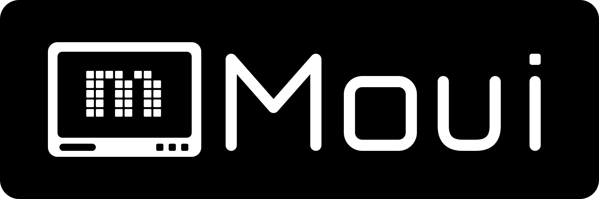

<p align="center">
  <picture>
    <source media="(prefers-color-scheme: dark)" srcset="assets/moui-lockup-dark.svg">
    <source media="(prefers-color-scheme: light)" srcset="assets/moui-lockup-light.svg">
    
  </picture>
</p>

<p align="center">
  <b>A lightweight mono-display UI framework for OLED, RLCD, and E-Paper screens</b>
</p>

<p align="center">
  <a href="README_CN.md"><b>简体中文</b></a> | <b>English</b>
</p>

<p align="center">
  
  
  
  
  
</p>

---

ESP Component Registry: `movecall/moui`

> 📢 **Project Status & Community Invitation**
> 
> Moui is currently in active development (**Beta / Developer Preview**). While core architecture and base widgets are backed by automated tests, real-world deployment across diverse hardware setups and edge cases benefits immensely from community exploration.
> 
> We warmly welcome your feedback and contributions! Whether you discover bugs on actual hardware, have performance suggestions, or request new features, feel free to open [Issues](../../issues) or submit [Pull Requests](../../pulls). Your testing and feedback are the driving forces shaping Moui's stability and growth! 🚀

## Documentation

- 📘 [**API Reference**](docs/api_reference.md) — Comprehensive guide for all 30 widgets, layout engines & animations
- 🛠️ [**Porting Guide**](docs/porting_guide.md) — Step-by-step MCU & display driver integration guide
- ⚡ [**Optimization Log**](docs/optimization_log.md) — Benchmark numbers, memory profiling & performance logs

## Installation

```yaml
# idf_component.yml
dependencies:
  movecall/moui: "^0.1.6"
```

## Minimal Example ("Hello Moui")

```c
#include "moui.h"

void app_init(moui_screen_mgr_t *mgr) {
    static moui_screen_t main_scr;
    moui_screen_init(&main_scr);

    // Create a label
    static moui_widget_label_t title;
    moui_label_init(&title, "Hello Moui!", &moui_font_inter_16);
    title.base.bounds = (moui_rect_t){20, 20, 160, 30};
    moui_screen_add_widget(&main_scr, &title.base);

    // Push screen to manager
    moui_screen_push(mgr, &main_scr);
}
```

## Features

- **Tiny footprint**: ~45 KB Flash, ~18 KB RAM
- **4-level grayscale**: `moui_color_t` supports WHITE/LGRAY/DGRAY/BLACK; 1bpp and 2bpp backends
- **30 widgets**: Full suite of controls including `VirtualList` (<1KB RAM for 100k+ items), `TimePicker`, `BarChart`, `Roller`, `IconBar`, `TreeView`, `LogView`, etc.
- **128 Material Mono Icons**: Built-in 16x16 vector mono icons with 1x/2x/3x integer scaling (`moui_draw_icon_scaled`) and alignment
- **4 Modern Architecture Subsystems**: Flexbox layout (`moui_layout_flex`), Anchor constraints (`moui_anchor`), Reactive data binding (`moui_property`), Timeline animations (`moui_timeline`)
- **Smooth 50 fps animation**: 10 easing functions + sequence/parallel groups + keyframe timelines
- **Cross-platform**: same UI code runs on any MCU and SDL2 desktop simulator
- **10 built-in display drivers**: SSD1306/SSD1309/SH1106/ST7565/ST7567/ST7920/UC1701/UC8151/SSD1677/ST7305
- **Kconfig trimming**: `idf.py menuconfig` to pick only the widgets/drivers/fonts you need
- **Font fallback chain**: auto CJK/Latin mixed rendering with `moui_font_set_fallback()`
- **Backend abstraction**: `moui_backend_t` interface + Full-FB / Page-Buffer modes
- **Encoder-native input**: ISR-safe ring buffer + focus chain + long-press/capture
- **Mono-specific**: 7 dither patterns + 8 texture fills + QR code + RLE / Floyd-Steinberg dithered bitmaps
- **Display rotation**: 0/90/180/270 degrees, two modes (zero-RAM pixel mapping or flush-time buffer transpose)
- **Theme / dark mode**: global color inversion, one-line toggle

## Project Structure

```
moui/
├── src/                Core framework (all platforms)
│   ├── hal/            HAL interface + display descriptor
│   ├── core/           Drawing, dither, patterns, QR, 128 icons, theme, style, events
│   ├── backend/        Backend abstraction: moui_backend_t + FB/Page
│   ├── drivers/        10 display driver templates (inc. ST7305)
│   ├── font/           Font engine
│   ├── input/          Input queue, focus manager, input device
│   ├── anim/           10 easing functions + timeline animation engine
│   ├── widget/         30 widgets (inc. VirtualList, TimePicker, BarChart, Roller, etc.)
│   ├── layout/         Stack container, Grid, Flexbox, Anchor
│   └── screen/         Screen stack + 7 transitions + popup
├── fonts/              Font data + generator tool
├── examples/           ESP-IDF examples + HAL reference
├── host/               Desktop simulator + demos (WeChat Chat Demo, App Framework Demo)
├── tools/              img_to_c.py / gen_font.py
├── idf_component.yml   Component metadata
└── CMakeLists.txt      Dual-mode build (ESP + desktop)
```

## Quick Start

### Simulator

```bash
cmake -B build && cmake --build build
./build/host/apps/st7305_4p2/st7305_4p2
```

Simulators included:
- `st7305_4p2` — 4.2" 300x400 RLCD (Reflective LCD) simulator (includes 17 demo screens: VirtualList 100k, WeChat Chat Demo, App Framework Demo, 128 Icons Gallery, Photorealistic Image test)
- `moui_sim` — Standard 128x64 OLED simulator
- `watch_sim` — Smartwatch UI simulator

Controls: `Up/Down` navigate / `Enter` confirm / `ESC` back / `R` rotate

### ESP-IDF

1. Add the component dependency (see Installation above)
2. `idf.py menuconfig` > Moui Configuration > select drivers and widgets
3. Refer to `examples/esp32s3_port/` for HAL implementation

### Adding a New Display (3 steps)

```c
// 1. Implement two transport functions
void my_write_cmd(uint8_t cmd, void *user) { /* SPI/I2C command */ }
void my_write_data(const uint8_t *d, uint32_t len, void *user) { /* data */ }

// 2. Initialize the driver
moui_drv_ssd1306_t display;
moui_drv_ssd1306_init(&display, &cfg);

// 3. Create draw context
moui_draw_ctx_t ctx;
moui_draw_ctx_init_be(&ctx, moui_drv_ssd1306_backend(&display));
```

## Backend Architecture

```c
struct moui_backend {
    void (*set_pixel)(moui_backend_t *be, int x, int y, moui_color_t c);
    moui_color_t (*get_pixel)(moui_backend_t *be, int x, int y);
    void (*clear)(moui_backend_t *be, moui_color_t c);
    void (*flush)(moui_backend_t *be);
    int width, height;
    int phys_w, phys_h;
    moui_rotation_t rotation;
    bool sw_rotate;
};
```

- **`moui_backend_fb_t`** — Full framebuffer (1 KB+ for 128x64)
- **`moui_backend_page_t`** — Page-buffer rendering (128 bytes for 128x64)

## Widget List (30 types)

| Widget | Description |
|--------|-------------|
| Label | Text (inverse, word-wrap, proportional font) |
| List | Scrollable list with animated indicator |
| VirtualList | High-performance recycled cell list (100k+ items <1KB RAM) |
| Button | Push / Toggle / Checkbox |
| Slider | Slider with value display |
| Chart | Waveform chart, ring buffer |
| ScrollView | Scroll container with scrollbar |
| StatusBar | Title + time + battery |
| Progress | Read-only progress bar |
| Radio | Radio button group |
| Spinner | Numeric stepper |
| Tab | Tabbed pages |
| Dropdown | Drop-down selector |
| TextInput | Character input field |
| TimePicker | HH:MM:SS wheel selection widget |
| BarChart | Dynamic histogram with gridlines & dither fill |
| Roller | 3D perspective wheel selector |
| IconBar | RSSI WiFi signal strength + battery status bar |
| TreeView | Expandable/collapsible hierarchy tree |
| LogView | Console ring-buffer log viewer with auto-scroll |
| Gauge | Semicircle gauge meter |
| Table | Data table |
| BtnMatrix | Button matrix |
| Switch | Slide toggle |
| Calendar | Month calendar |
| Image | Bitmap display (RLE & Floyd-Steinberg dither supported) |
| Ring | Arc progress indicator |
| Keyboard | On-screen keyboard |
| Extra | Dots / Number / Stepper / Sparkline / Checklist |
| Misc | Marquee / Badge / Divider / Loading |

## Performance & Optimization

| Metric | Value |
|--------|-------|
| Frame rate | 50 fps |
| hline optimization | Byte-level memset, 3-5x speedup |
| 180° rotation transpose | < 12 μs / frame (20x speedup) |
| Full-screen DMA | 1.6 ms (8064 B @ 40 MHz) |
| Smart refresh | Skip unchanged frames, zero CPU |
| Memory safety | 70/70 unit tests 100% PASS |
| Code size | ~45 KB |
| RAM usage | ~18 KB (VirtualList < 1 KB) |

## License

MIT
